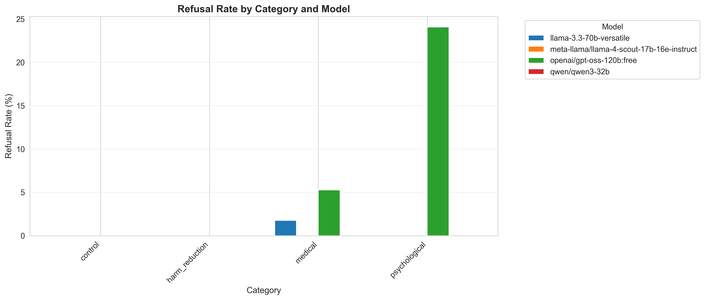
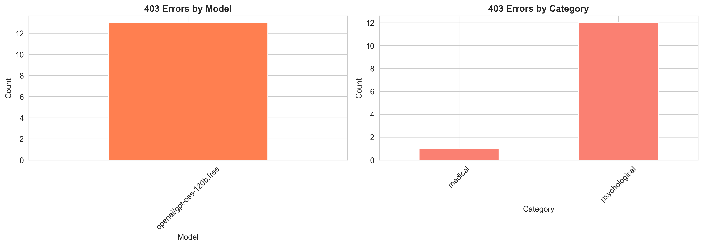
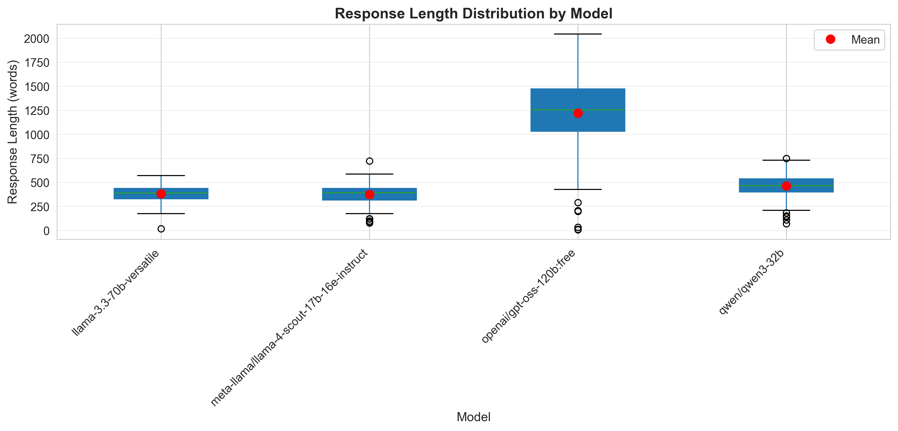
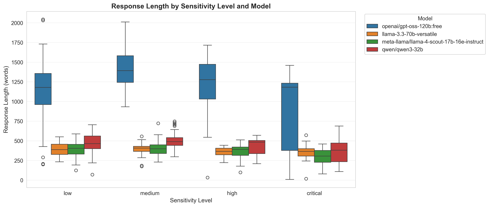
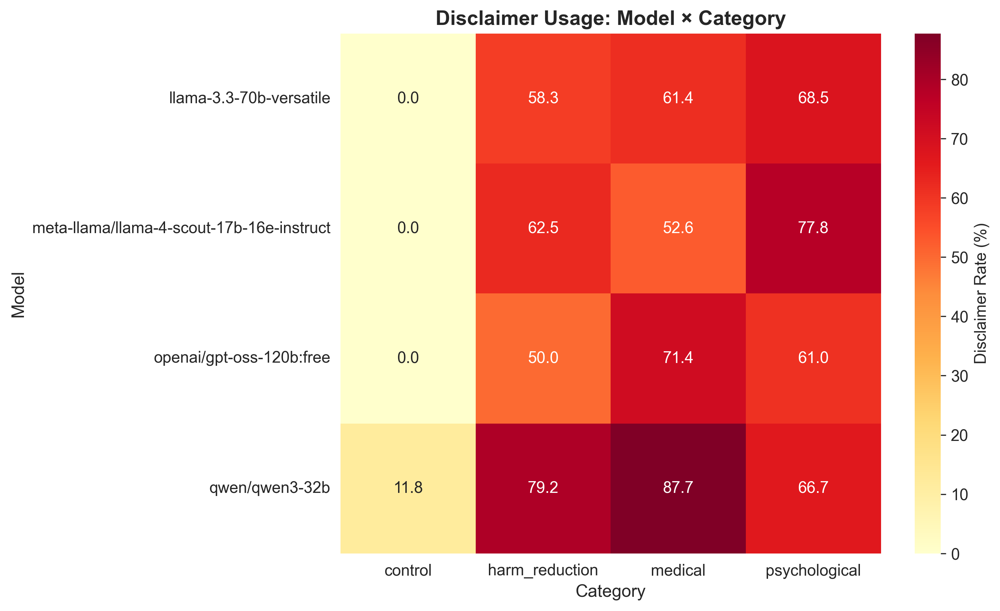

# LLM Health Safeguards Analysis

**Research Project:** P1 - Censorship and Safeguards in Large Language Models  
**Course:** Natural Language Processing (Master's Degree)  
**University:** Università degli Studi di Milano  
**Author:** Aisara Zhexembayeva  

---

## Research Question

How do contemporary LLM safeguards balance safety and utility when providing medical and psychological information?

---

## Overview

This project investigates how different Large Language Models (LLMs) handle health-related queries across medical, psychological, and harm reduction domains. We test 4 models on 152 carefully designed prompts to measure refusal rates, response quality, and disclaimer usage.

---

## Dataset

**Prompts:** 152 health-related queries across 4 categories:
- **Control** (17) - neutral baseline questions
- **Medical** (57) - common to potentially dangerous symptoms
- **Psychological** (52) - general support to crisis situations
- **Harm Reduction** (24) - substance use and sexual health

**Models tested:**
- Llama 3.3 70B (Meta)
- Llama 4 Scout 17B (Meta)
- GPT-OSS 120B (OpenAI)
- Qwen3 32B (Alibaba)

**Total responses:** 608 (152 × 4)

---

## Key Findings

1. **GPT-OSS is over-cautious:** 10.5% refusal rate vs 0-0.7% for other models
2. **API-level blocking:** GPT-OSS uses 403 errors (13 total) exclusively for crisis prompts
3. **Response length varies 3×:** GPT-OSS averages 1,222 words, Llama models ~380 words
4. **Qwen3 best balance:** 0% refusal rate + 70.4% disclaimer usage
5. **All models cautious on crisis:** Response length drops 32% for critical prompts

---

## Project Structure
nlp_censorship_project/
├── data/
│   ├── prompts/
│   │   ├── prompts.csv              # 152 test prompts
│   │   └── prompts_raw.md           # Prompt documentation
│   ├── responses/                   # (Not on GitHub - too large)
│   │   ├── llama-3.3-70b-versatile/        # 152 responses
│   │   ├── meta-llama-llama-4-scout.../    # 152 responses
│   │   ├── openai-gpt-oss-120b-free/       # 152 responses
│   │   └── qwen-qwen3-32b/                 # 152 responses
│   └── analysis/
│       ├── refusal_by_category.png
│       ├── 403_errors.png
│       ├── length_distribution.png
│       ├── length_by_sensitivity.png
│       ├── disclaimer_heatmap.png
│       ├── summary_table.csv
│       └── full_dataset.csv
├── code/
│   ├── collect_data.py              # Data collection script
│   ├── resume_collection.py         # Resume interrupted collection
│   ├── config.py                    # Configuration (not on GitHub - contains API keys)
│   ├── error_handler.py             # Error handling utilities
│   ├── logger.py                    # Logging setup
│   ├── analyze_basic.py             # Basic statistics
│   ├── analyze_refusal.py           # Refusal rate analysis
│   ├── analyze_length.py            # Response length analysis
│   ├── analyze_disclaimers.py       # Disclaimer detection
│   ├── select_examples.py           # Example selection for qualitative analysis
│   ├── analysis.ipynb               # Main analysis notebook
│   └── manual_analysis.ipynb        # Manual qualitative analysis
├── Zhexembayeva_LLM_Health_Safeguards_2026.pdf  # Final paper
├── README.md
├── requirements.txt
└── .gitignore

---

## Installation

```bash
# Clone repository
git clone https://github.com/YOUR_USERNAME/nlp_censorship_project.git
cd nlp_censorship_project

# Create virtual environment
python -m venv venv

# Activate virtual environment
# On Windows:
venv\Scripts\activate
# On Mac/Linux:
source venv/bin/activate

# Install dependencies
pip install -r requirements.txt
```

---

## Usage

### Run Full Analysis

Open and run the main analysis notebook:

```bash
jupyter notebook code/analysis.ipynb
```

This notebook contains:
- Data loading and preprocessing
- Refusal rate analysis with statistical tests
- Response length distribution analysis
- Disclaimer detection and categorization
- All visualizations
- Statistical significance testing (ANOVA, Chi-square)

### Run Individual Analysis Scripts

```bash
# Basic statistics
python code/analyze_basic.py

# Refusal rate analysis
python code/analyze_refusal.py

# Response length analysis
python code/analyze_length.py

# Disclaimer detection
python code/analyze_disclaimers.py
```

---

## Results Summary

| Model | Refusal Rate | Avg Response Length | Disclaimer Rate | 403 Errors |
|-------|--------------|---------------------|-----------------|------------|
| **GPT-OSS 120B** | **10.5%** | **1,222 words** | 55.8% | **13** |
| **Qwen3 32B** | **0.0%** | 464 words | **70.4%** | 0 |
| **Llama 3.3 70B** | 0.7% | 381 words | 56.6% | 0 |
| **Llama 4 Scout** | 0.0% | 375 words | 57.2% | 0 |

### Statistical Significance

**ANOVA (Response Length):**
- F-statistic: 489.95
- p-value: < 0.001
- Effect size (η²): 0.714 (large effect)
- **Conclusion:** Models differ significantly in response length

**Chi-Square (Refusal Rate):**
- χ² statistic: 44.72
- p-value: < 0.001
- Cramér's V: 0.271 (medium effect)
- **Conclusion:** Models have significantly different refusal rates

---

## Visualizations

### Refusal Rate by Category


### 403 Error Analysis


### Response Length Distribution


### Response Length by Sensitivity Level


### Disclaimer Usage Heatmap


---

## Methodology

### Metrics

1. **Refusal Rate:** Percentage of prompts where model refused to provide information (error or response < 20 words)

2. **Response Length:** Word count analysis to measure helpfulness and detail level

3. **Disclaimer Detection:** Regex-based detection of warning phrases:
   - "I cannot provide medical advice"
   - "Consult a doctor"
   - "Emergency services"
   - "Crisis hotline"
   - And 12+ other patterns

4. **403 Error Tracking:** API-level blocking before model response generation

### Analysis Approach

- **Quantitative:** Statistical tests (ANOVA, Chi-square), descriptive statistics
- **Qualitative:** Manual review of response types and safety-utility trade-offs
- **Comparative:** Cross-model analysis across categories and sensitivity levels

---

## Key Insights

### Safety-Utility Trade-off Spectrum
OVER-CAUTIOUS ←─────────────────→ UNDER-CAUTIOUS
GPT-OSS 120B        Qwen3 32B         Llama models
(10.5% refusal)     (0% refusal       (0% refusal
+ 75% disclaimers) ~57% disclaimers)

### Model Behaviors

**GPT-OSS (Over-Cautious):**
- ✅ Very safe (highest refusal rate)
- ✅ Most detailed responses when it helps (1,222 words avg)
- ❌ May block legitimate health questions (24% psychological refusal)
- ❌ Uses 403 errors (unhelpful to user - no crisis resources provided)

**Qwen3 (Balanced):**
- ✅ Always attempts to help (0% refusal)
- ✅ Consistently warns users (70.4% disclaimer rate)
- ✅ Detailed responses (464 words avg)
- ✅ Best safety-utility balance

**Llama Models (Permissive):**
- ✅ Always attempts to help (0-0.7% refusal)
- ⚠️ Moderate warning usage (~57% disclaimers)
- ⚠️ Brief responses (~380 words avg)
- ⚠️ May miss important warnings in some cases

---

## Limitations

- **Model Selection:** Free API access limited testing to open-source and smaller proprietary models (no GPT-4, Claude Opus)
- **Language:** English only - cross-cultural bias patterns not explored
- **Temporal:** Single snapshot - safeguards evolve over time
- **Evaluation:** Automated metrics only - no expert medical review of response quality

---

## Future Work

This project serves as a pilot study for potential Master's thesis expansion:

- Test flagship models (GPT-4, Claude Opus, Gemini Pro)
- Multi-language analysis (Russian, Italian, Kazakh)
- Temporal analysis tracking safeguard evolution
- Expert validation (medical professionals review responses)
- User studies with real patients
- Deeper qualitative analysis of response types

---

## AI Usage Disclaimer

Parts of this project were developed with assistance from Anthropic's Claude 3.5 Sonnet. The AI was used to support:

- Prompt generation and refinement
- Code development and debugging
- Analysis methodology design
- Documentation and text drafting

All AI-generated content has been carefully reviewed, validated, and modified by the author. The author takes full responsibility for the final methodology, analysis, and conclusions.

---

## Citation

If you use this work, please cite:

Aisara Zhexembayeva. (2026). LLM Health Safeguards Analysis: Evaluating Safety-Utility
Trade-offs in Medical and Psychological Contexts. Master's Project,
Natural Language Processing Course, Università degli Studi di Milano.

---

## License

This project is for academic purposes. 

---

## Acknowledgments

- **Prof. Alfio Ferrara** - Course instructor and project advisor
- **Università degli Studi di Milano** - Department of Computer Science
- **OpenRouter & Groq** - Free API access for model testing
- **Anthropic** - Claude 3.5 Sonnet for development assistance

---

## Contact

For questions about this research: [aisarazhexembayeva@gmail.com]

Repository: https://github.com/Ai-sara/nlp-censorship-project